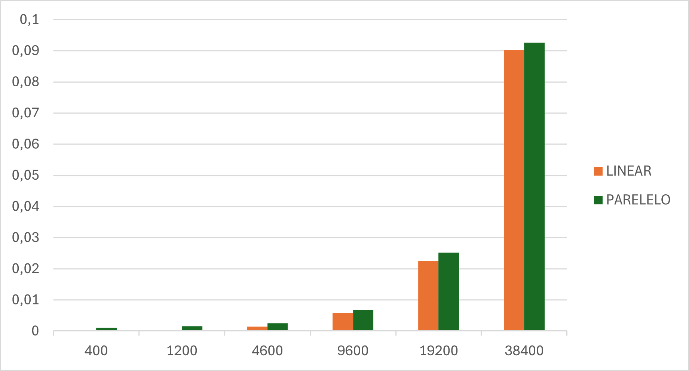

# Súmario
1 - [BucketSort](#bucketsort)
2 - [Friendly](#friendly)
3 - [Nbody](#nbody)

# Relatório

De início foi recebido um conjunto de códigos seriais, de onde deveriam ser selecionados apenas três e então paralelizados utilizando dois métodos de paralelização distindos. Os métodos de paralelização vieram de conjunto de três métodos no qual deveriamos escolher apenas dois.
Os algoritmos escolhidos para a paralelização foram:
- BucketSort;
- friendly;
- nbody.

Os métodos de paralelização foram:
- OpenMP;
- OpenACC.

## BucketSort
No arquivo fornecido pelo professor a ordenação ocorre da seguinte forma serial:
- Os baldes são criados inicializados e os valores distribuidos para cada _Bucket_.
- A ordenação ocorre em cada _Bucket_ um em seguida do outro.
  - Usando o método do _Insertion Sort_.

Para deixar que a ordenação ocorrece de forma paralelizada, foi utilizado a biblioteca _OpenMP_, que disponibiliza alguns ```pragmas``` para serem utilizados. Com isso foi feita da seguinte maneira a paralelização.
- Com a inserção da biblioteca _OpenMP_, foi apenas inserido antes do _looping for_ que realizava a chamada do _Insertion Sorte_ para cada _Bucket_ um diretiva ```#pragma omp parallel for```
Essa diretiva indica ao processador, que cada iteração do looping deve ser executava em um _threading_ separada.

### Dados
Em seguida sera mostrado alguns dados e métricas referentes ao codigo paralelizado.
- No seguinte gráfico vemos o tempo gasto em segundos para a execução do código, tanto linear quanto paralelo.

- Aqui podemos ver que para as quantidade de dados passadas para o programa a diferença do tempo de execução para os dois modos foi parecido, mas é visivel que quanto maior é o tamanho da entrada, mais vantagem temos com a paralelização

Entradas maiores que 50000 travavam o terminal, então para manter uma certa escala, foi feitos apenas os testes com os tamanhos mostrados nos graficos.

## Friendly
No arquivo fornecido pelo professor o processor de encontrar os _friendly numbers_ ocorre da seguinte forma serial:
- É passado como parametro dois números que definem um intervalo.
- Para cada número no intervalo fornecido, é calculado a sua razão e a armazena em um vetor.
- Em seguida esse vetor é varrido por dois _loopings_ aninhados, onde é verificado se a razão de dois números são iguais, e se forem, então eles são  _friendly numbers_.

Para a paralelização desse código também foi utilizado a biblioteca _OpenMP_, e a paralelização foi feita da seguinte forma:
- Com a inserção da biblioteca _OpenMP_, foi apenas inserido antes do _looping for_ que realizava o cálculo das razões para cada número do intervalo a mesma diretiva que foi utilizada no _BucketSort_, porem com algumas adições ```#pragma omp parallel for private(i) schedule(dynamic)```.
  - O schedule(dynamic) foi utilizado para que as iterações fossem distribuídas de forma dinâmica entre os _threads_, isso foi feito pois o tempo de cálculo da razão de cada número varia muito, e com isso o balanceamento do trabalho entre os _threads_ fica melhor.
  - O private(i) foi utilizado para que cada _thread_ tivesse sua própria cópia da variável de controle do looping, evitando assim problemas de concorrência.
- Por ultimo no _looping_ aninhado que verifica as razões iguais, foi adicionado a diretiva ```#pragma omp for```, para que esse _looping_ também fosse paralelizado.

### Dados


## Nbody